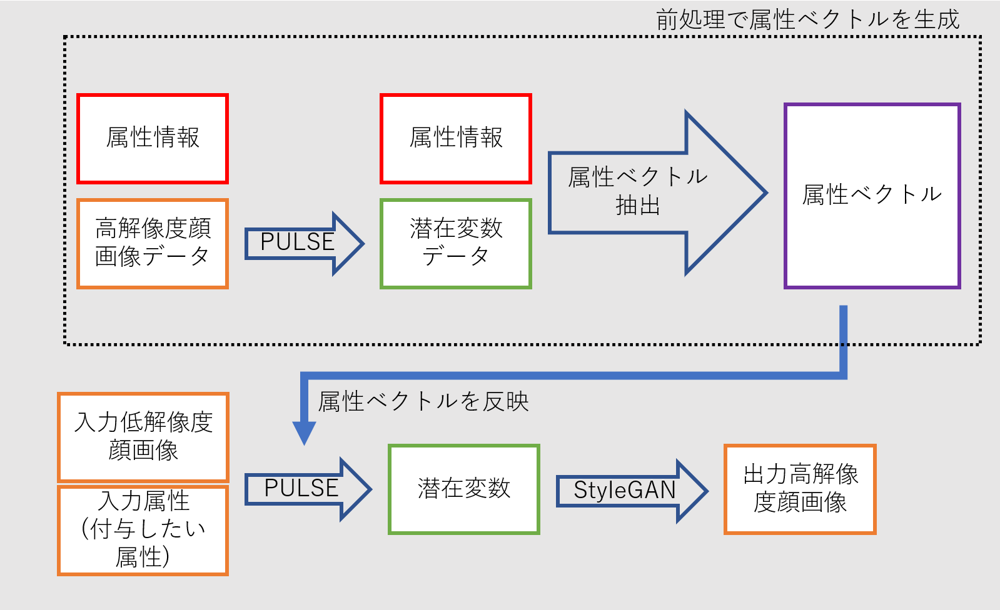

# PULSE with ATTR
PULSE( https://github.com/adamian98/pulse )をもとにした、属性付与に対応した顔画像の超解像処理モデルです。

## 実行結果


上は( 笑顔属性 or 属性付与なし or 真顔属性 ) ｘ (男性属性 or 属性付与なし or 女性属性付与)の計９種類の超解像処理科結果画像です。

## 処理の流れ

このリポジトリでは、属性ベクトル生成に必要なデータ(`average_latent_dict.npy`)は作成済みのため、前処理部分はスキップできます。<br>

## 実行方法
```
python run_useLatent.py -input_dir demo_low_input
```
`demo_low_input`ディレクトリ内にある全ての画像を超解像処理します。デフォルトでは男性属性と笑顔属性が付与され、結果が`runs`ディレクトリに保存されます。
<br>

付与する属性を変えたい場合は `loss_attr_str`オプションを使います
```
オプション
-loss_attr_str [ 属性の向き(1 or 0) ]*[ 付与したい属性名 ]+...
```
<br>

属性名が`Male(男性)`で属性の向きが`0`の場合、対になる`女性属性`が付与されます。
- 女性属性のみ付与のコマンド例
```
python run_useLatent.py -input_dir demo_low_input -loss_attr_str 0*Male
```
<br>

属性名が`Male(男性)`で属性の向きが`1`の場合、通常通り`男性属性`が付与されます。
- 男性属性のみ付与のコマンド例
```
python run_useLatent.py -input_dir demo_low_input -loss_attr_str 1*Male
```
<br>

付与したい属性が複数ある場合は「`+`」で結合していきます。
- 男性属性と老人属性付与のコマンド例
```
python run_useLatent.py -input_dir demo_low_input -loss_attr_str 1*Male+0*Young
```
<br>

属性名は`CelebAMask-HQ-attribute-anno.txt`に記載されているものに限ります。

## 前処理の手順（この処理はスキップできます）
1. https://github.com/switchablenorms/CelebAMask-HQ の高解像度顔画像データを潜在変数に変換
```
python run_getLatent.py -input_dir [画像データのあるディレクトリ] -latent_dir [潜在変数データを保存するディレクトリ]
```
この処理により画像データから潜在変数データを得ることができます。
- 例
```
python run_getLatent.py -input_dir demo_high_input -latent_dir latent
```
2. 潜在変数データと属性情報(`CelebAMask-HQ-attribute-anno.txt`)のペアから、各属性ごとの潜在変数の平均値データ(`average_latent_dict.npy`)を作成。この処理は`dataloader.py`で行っています。

3. 本処理時には`average_latent_dict.npy`と`CelebAMask-HQ-attribute-anno.txt`から属性ベクトルを生成しています。


## 環境構築
おおもとであるPULSE( https://github.com/adamian98/pulse )を参考にお願いします。
